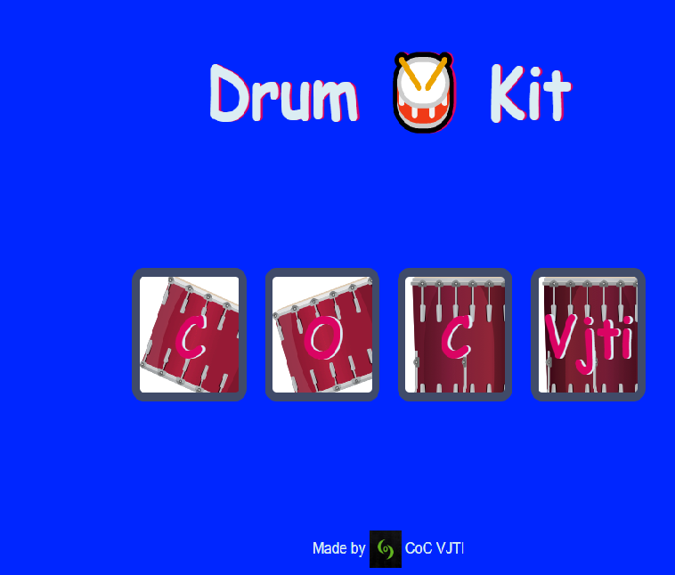

# DrumKit 
#### A project for FYs under CoC WebDev Workshop.

The folder structure contains files in the following format : 
* The **OnlyHTMLStuff** folder contains the HTML file only. This is a starter file
used as a base. To be taught once the HTML Session has finished. After creating only
the HTML file, the file is displayed in the browser as follows :

* After this, the **HTML&CSS_Stuff**folder contains the designing using the
`style.css` file. The HTML file is linked and the resulting page is as:

* All that's now left is to give some functionality to the Buttons.
That is done in the **HTML_CSS_JS_Stuff** folder by adding the scripting file `script.js` and linking
it to the HTML file. The final output with a preview is :

That's it. We're done. A Project by CoC for FYs in the WebDev Workshop.
